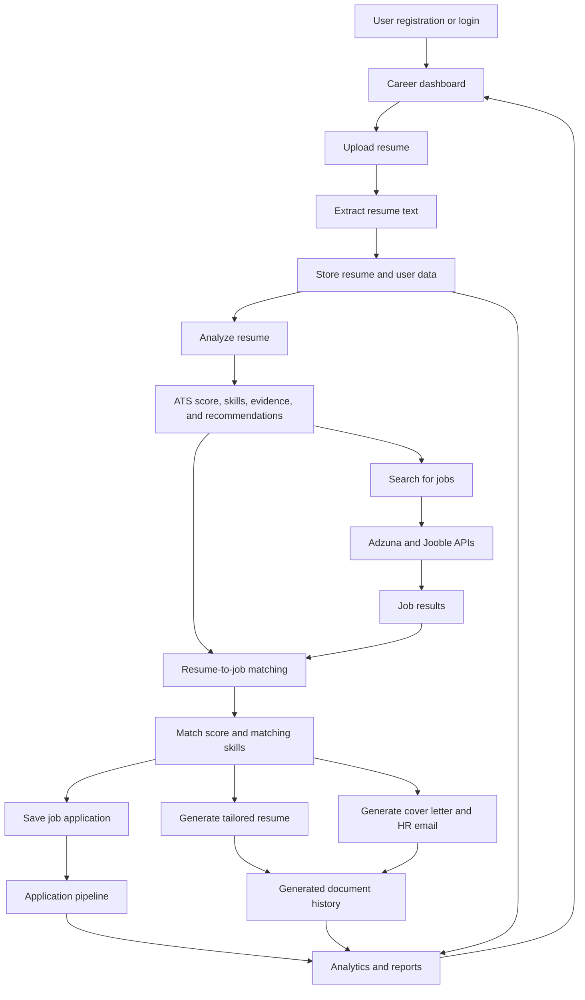
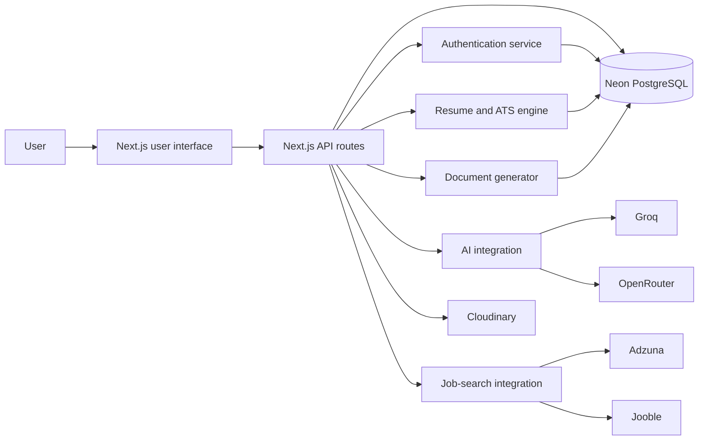

# CareerPilot AI

CareerPilot AI is an AI-powered career intelligence platform for managing resumes, analyzing ATS readiness, finding matching jobs, generating tailored career documents, tracking applications, and maintaining a professional portfolio.

The app is built with Next.js, Neon PostgreSQL, Groq/OpenRouter, Adzuna, Jooble, Cloudinary, and document-generation tooling. Uploaded resumes, analyses, generated documents, applications, profile data, projects, and certificates are stored for reuse across the workspace.

## Features

### Resume management

- Upload PDF, DOCX, or TXT resumes up to 4 MB.
- Extract and preview resume text.
- Store original files in Cloudinary, with database-backed resume metadata.
- View, download, update, and delete saved resumes.
- Extract factual skills, categories, evidence, and career keywords from resume content.
- Preserve resume source context for later tailoring and generated documents.

### Resume analysis

- ATS-oriented structural assessment.
- Resume quality score from 0 to 100.
- Strengths, weaknesses, evidence, and recommended improvements.
- Evaluation of contact information, sections, experience, education, projects, skills, measurable achievements, and formatting.
- Job-specific match percentages calculated separately from the general resume score.

### Job search and matching

- Search jobs by role, keywords, and location.
- Fetch normalized job results from Adzuna and Jooble when credentials are configured.
- Search with or without selecting a resume.
- Calculate match scores and matching resume keywords for selected jobs.
- Open original job listings and save jobs to the application tracker.

### AI document generation

- Generate tailored resumes for selected jobs.
- Generate job-specific cover letters and HR email drafts.
- Use facts from the uploaded resume and saved profile data instead of inventing qualifications.
- Download ATS-friendly DOCX files.
- Reopen previously generated resumes and cover letters from document history.

### Career workspace

- Dashboard with resume, application, interview, offer, and ATS metrics.
- Application pipeline with Applied, Interview, Offer, and Rejected stages.
- Projects and certificates management.
- Profile settings, CV profile builder, visibility controls, and portfolio data.
- Analytics based on saved applications, resumes, projects, certificates, and generated documents.
- Responsive sidebar, mobile navigation, favicon, and light/dark themes.

## Technology Stack

| Area | Technology |
| --- | --- |
| Application | Next.js 16 App Router, React 19, TypeScript |
| Styling | Custom responsive CSS, Bootstrap Icons, Lucide-style icon components |
| Database | Neon PostgreSQL |
| Database client | `postgres` |
| Authentication | Database-backed HTTP-only sessions, scrypt password hashing |
| AI | Groq primary provider, OpenRouter fallback |
| Job providers | Adzuna and Jooble |
| File storage | Cloudinary raw assets with database fallback metadata |
| Resume extraction | `pdf-parse`, `pdfjs-dist`, `mammoth`, Hugging Face OCR fallback |
| DOCX generation | `docx` |
| Charts | Recharts |
| Hosting | Vercel |

## Project Structure

```text
app/
  api/                    Next.js API routes
  careerpilot.css         Main workspace UI styles
  cv-document.css         CV preview and document styling
  globals.css             Base global styles
  layout.tsx              Root layout and metadata
  page.tsx                Main career workspace UI
database/                 Idempotent SQL migrations
lib/
  ai.ts                   Groq/OpenRouter integration
  applications.ts         Application data helpers
  ats.ts                  Resume analysis and job matching
  auth.ts                 Password and session handling
  cloudinary.ts           Original resume storage
  cv-docx.ts              CV DOCX export helpers
  cv-document.ts          CV document shaping
  db.ts                   Neon database connection
  job-keywords.ts         Resume/job keyword extraction
  professional-docx.ts    Resume and cover-letter DOCX renderer
  resume-text.ts          PDF, DOCX, TXT, and OCR text extraction
  validation.ts           Shared request validation helpers
scripts/
  migrate.mjs             Database migration runner
types/
  dommatrix.d.ts          DOMMatrix type support for PDF tooling
```

## Requirements

- Node.js 20.16 or newer
- npm
- Neon PostgreSQL database
- At least one AI provider key for generated advice/documents
- Adzuna and/or Jooble credentials for live job search
- Cloudinary credentials for durable original resume file storage
- Hugging Face key if OCR fallback is needed for scanned PDFs

## Environment Variables

Create a local `.env` file. Use the pooled Neon connection URL whose hostname contains `-pooler`, and never prefix server secrets with `NEXT_PUBLIC_`.

| Variable | Required | Purpose |
| --- | --- | --- |
| `DATABASE_URL` | Yes | Pooled Neon PostgreSQL connection string |
| `GROQ_API_KEY` | Recommended | Primary AI generation provider |
| `OPENROUTER_API_KEY` | Recommended | AI fallback provider |
| `AI_MODEL` | No | Groq model; defaults to `llama-3.3-70b-versatile` |
| `ADZUNA_APP_ID` | For Adzuna | Adzuna application ID |
| `ADZUNA_APP_KEY` | For Adzuna | Adzuna application key |
| `ADZUNA_COUNTRY` | No | Adzuna country code; defaults to `in` |
| `JOOBLE_API_KEY` | For Jooble | Jooble job-search key |
| `CLOUDINARY_CLOUD_NAME` | Recommended | Cloudinary account cloud name |
| `CLOUDINARY_API_KEY` | Recommended | Cloudinary API key |
| `CLOUDINARY_API_SECRET` | Recommended | Cloudinary API secret |
| `HUGGINGFACE_API_KEY` | Optional | OCR fallback for scanned/image-only PDFs |
| `HUGGINGFACE_OCR_MODEL` | No | OCR vision model; defaults to `Qwen/Qwen2.5-VL-3B-Instruct` |

The `.gitignore` excludes `.env`, `.env.local`, `.env.*.local`, `.next`, and `.vercel`. Do not commit private credentials.

## Local Setup

Install dependencies:

```powershell
npm install
```

Apply or update the database schema:

```powershell
npm run db:migrate
```

Start the development server:

```powershell
npm run dev
```

Open [http://localhost:3000](http://localhost:3000).

## Available Commands

| Command | Description |
| --- | --- |
| `npm run dev` | Start the Next.js development server |
| `npm run lint` | Run TypeScript validation with `tsc --noEmit` |
| `npm run build` | Create an optimized production build |
| `npm start` | Run the compiled production application |
| `npm run db:migrate` | Apply all idempotent SQL migrations using `.env` |

## API Overview

Public routes:

- `GET /api/health`
- `POST /api/auth/register`
- `POST /api/auth/login`

Authenticated routes include:

- `GET /api/auth/me`
- `POST /api/auth/logout`
- `GET|POST /api/resumes`
- `DELETE /api/resumes/:id`
- `GET /api/resumes/:id/view`
- `GET /api/resumes/:id/download`
- `POST /api/resumes/:id/analyze`
- `POST /api/resumes/:id/tailor`
- `POST /api/resumes/:id/cover-letter`
- `GET /api/tailored-resumes/:id/download`
- `POST /api/cover-letters`
- `GET /api/cover-letters/:id/download`
- `GET|POST /api/applications`
- `PATCH|DELETE /api/applications/:id`
- `GET /api/jobs`
- `POST /api/job-keywords`
- `GET|PUT /api/profile`
- `POST /api/profile/summary`
- `POST|DELETE /api/profile/resume`
- `GET|POST /api/projects`
- `PATCH|DELETE /api/projects/:id`
- `GET|POST /api/certificates`
- `PATCH|DELETE /api/certificates/:id`
- `GET /api/portfolio`
- `GET /api/dashboard`
- `GET /api/analytics`
- `GET /api/generated-documents`
- `POST /api/ai`
- `GET|PUT|DELETE /api/account`

## Database Schema

The migration files in `database/` create and maintain the application schema, including:

- `users`
- `sessions`
- `resumes`
- `resume_analyses`
- `tailored_resumes`
- `cover_letters`
- `applications`
- `profiles`
- `projects`
- `certificates`

Later migrations add workspace modules, application insights, CV profile fields, profile visibility, CV variants, skill categories, ATS evidence fields, resume source tracking, and cover-letter source tracking.

Migrations use idempotent `CREATE ... IF NOT EXISTS` and `ADD COLUMN IF NOT EXISTS` patterns, so they can be run repeatedly. Foreign keys use cascading deletion where appropriate; deleting a resume also removes its related analyses, tailored resumes, and cover letters.

## Resume Upload Behavior

The production upload limit is 4 MB because Vercel Functions accept request payloads up to 4.5 MB. The app validates file size in both the browser and API.

Supported formats:

- PDF (`.pdf`)
- Microsoft Word (`.docx`)
- Plain text (`.txt`)

Scanned or image-only PDFs can use the configured Hugging Face OCR fallback. Password-protected or corrupted PDFs cannot be read reliably.

## Deployment

See [DEPLOYMENT.md](DEPLOYMENT.md) for the Vercel deployment checklist and [BACKEND.md](BACKEND.md) for backend configuration notes.

At a high level:

1. Create a Neon project and use the pooled `DATABASE_URL`.
2. Add required environment variables locally and in Vercel.
3. Run `npm run db:migrate` against the target database.
4. Deploy the Next.js app to Vercel.
5. Verify `/api/health`, registration/login, resume upload, job search, document generation, and downloads.

## Security

- Passwords are salted and hashed with Node.js `scrypt`.
- Authentication uses random, hashed, database-backed session tokens.
- Session cookies are HTTP-only, `SameSite=Lax`, and secure in production.
- Database queries use parameterized SQL templates.
- Resume, generated-document, profile, and workspace routes verify record ownership.
- Secrets remain server-side and are excluded from Git.

If a database URL or API key is pasted into chat, committed, included in screenshots, or otherwise exposed, rotate it immediately in the provider dashboard and update Vercel.

## Troubleshooting

### Database connection failed

- Confirm `DATABASE_URL` is present.
- Use the Neon pooled hostname containing `-pooler`.
- Keep `sslmode=require` in the connection URL.
- Run `npm run db:migrate`.
- Check `/api/health`.

### AI generation unavailable

- Confirm `GROQ_API_KEY` or `OPENROUTER_API_KEY` is configured.
- Confirm the selected model is available to that provider.
- Redeploy after changing Vercel environment variables.

### No jobs returned

- Confirm at least one job provider is configured.
- Verify `ADZUNA_APP_ID`, `ADZUNA_APP_KEY`, `ADZUNA_COUNTRY`, and/or `JOOBLE_API_KEY`.
- Try a broader role and location.

### Resume cannot be viewed or downloaded

- Confirm all three Cloudinary values are configured.
- Upload a new resume after configuring Cloudinary.
- Old records cannot recover an original file that was never stored successfully.

### PDF text is missing

- Ensure the PDF contains selectable text.
- Remove password protection.
- Configure `HUGGINGFACE_API_KEY` for OCR fallback on scanned/image-only PDFs.

## Management Information System

CareerPilot AI is a career-focused Management Information System. It collects career data, processes it through AI and external services, stores the results, and presents useful information that supports employment and career-management decisions.

The system helps users:

- Manage resumes and professional profiles.
- Evaluate resume quality and ATS compatibility.
- Find relevant employment opportunities.
- Compare resumes with job descriptions.
- Generate tailored resumes, cover letters, and HR emails.
- Track job applications through different stages.
- Monitor career progress through dashboards and analytics.

### MIS Process Flow



### MIS Cycle

The platform follows the standard MIS cycle of input, processing, storage, output, and feedback.

| Stage | Description |
| --- | --- |
| Input | Account data, profile information, resume files, projects, certificates, job-search queries, job descriptions, and live job listings |
| Processing | Authentication, text extraction, skill detection, ATS analysis, job search, resume-job comparison, AI document generation, and analytics calculations |
| Storage | Neon PostgreSQL stores users, sessions, resumes, analyses, profiles, applications, projects, certificates, tailored resumes, and cover letters; Cloudinary stores original files when configured |
| Output | ATS scores, recommendations, extracted skills, job listings, match percentages, tailored documents, application pipeline data, and dashboard metrics |
| Feedback | Users update profiles, improve resumes, change job searches, move applications between stages, and use analytics to guide future decisions |

### MIS Modules

| Module | Input | Processing | Output |
| --- | --- | --- |
| Authentication | Email and password | Validation, hashing, and session creation | Secure system access |
| Resume management | PDF, DOCX, or TXT file | Validation, extraction, and storage | Resume record and preview |
| Resume analysis | Extracted resume text | ATS and AI analysis | Score, evidence, and recommendations |
| Job search | Role, keywords, and location | Adzuna and Jooble requests | Relevant vacancies |
| Job matching | Resume and job description | Keyword and relevance comparison | Match percentage and skills |
| Document generation | Resume, profile, and selected job | AI-based tailoring | Resume, cover letter, and HR email |
| Application tracking | Company, role, and status | Pipeline management | Application records |
| Profile management | Personal and career data | Validation and database update | Professional portfolio |
| Analytics | Stored career information | Aggregation and calculation | Dashboard statistics |

### System Architecture



### Management Levels Supported

- **Operational level:** uploading resumes, searching for jobs, generating documents, and recording applications.
- **Tactical level:** comparing job matches, monitoring application stages, and improving resumes.
- **Strategic level:** reviewing career analytics, identifying skill gaps, and planning long-term career development.

### Key MIS Principles

- **Data-driven decisions:** recommendations are based on resume, job, profile, and application information.
- **Centralized information:** career records are maintained in one workspace.
- **User-specific processing:** authenticated users can access only their own records.
- **AI-assisted processing:** AI generates recommendations and documents from supplied information.
- **Factual document generation:** tailored documents use source facts and avoid invented qualifications.
- **Continuous monitoring:** dashboard information changes as resumes and applications are updated.
- **External integration:** job and AI providers supplement locally stored information.
- **Information security:** passwords are hashed, sessions use HTTP-only cookies, and database queries are parameterized.

CareerPilot AI transforms raw resume, profile, job, and application data into actionable information such as ATS scores, job matches, tailored documents, and career analytics. These outputs help users make informed career decisions and monitor progress from a centralized workspace.
